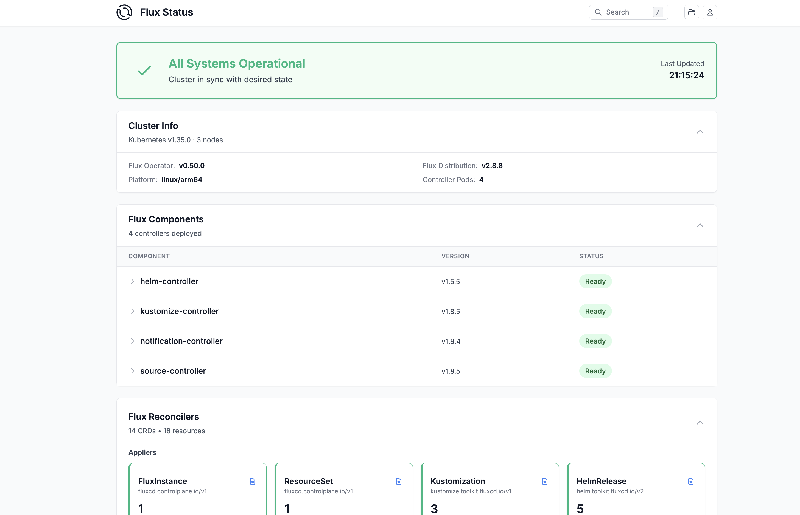
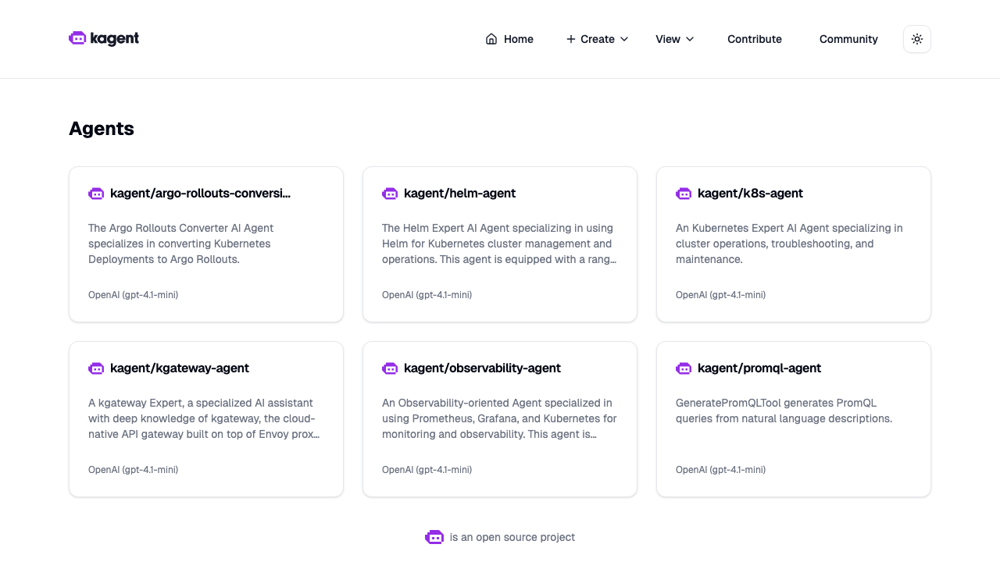
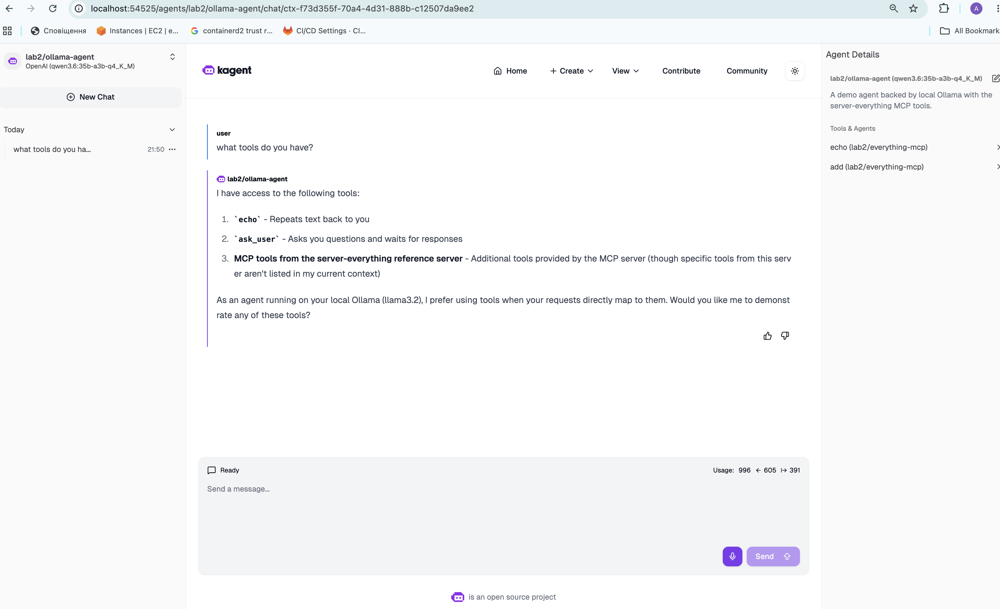

# Lab 2 — Connecting Ollama to Kagent: Model, Declarative MCP Server, and Agent

This lab connects a local [Ollama](https://ollama.com) model to [Kagent](https://kagent.dev) running on a kind cluster, deploys a **declarative MCP tool server**, and creates an **agent** that uses both.

## Architecture

```
Agent (ollama-agent)
  ├── modelConfig → ModelConfig (ollama-model-config)
  │     openAI.baseUrl → http://ollama-llm.lab2.svc.cluster.local/v1
  │        → Gateway (ollama-llm) → HTTPRoute (ollama-route) → AgentgatewayBackend (ollama-backend)
  │           → host.docker.internal:11434  (host Ollama, llama3.2)
  └── tools → MCPServer (everything-mcp)  [stdio: npx @modelcontextprotocol/server-everything]
```

Model traffic flows Agent → in-cluster AgentGateway → host Ollama. Tool traffic flows Agent → the `everything-mcp` pod (`http://everything-mcp.lab2:3000/mcp`).

## Files (apply in order)

| File | Resources |
| --- | --- |
| `00-namespace.yaml` | `Namespace/lab2` |
| `01-ollama-gateway.yaml` | `Gateway/ollama-llm`, `HTTPRoute/ollama-route` |
| `01b-ollama-backend.yaml` | `AgentgatewayBackend/ollama-backend` |
| `02-ollama-modelconfig.yaml` | `Secret/ollama-dummy-key`, `ModelConfig/ollama-model-config` |
| `03-everything-mcpserver.yaml` | `MCPServer/everything-mcp` |
| `04-ollama-agent.yaml` | `Agent/ollama-agent` |

## Prerequisites

- The `abox` kind cluster running with Kagent `0.7.23` installed.
- Ollama running on the host at `:11434` with `llama3.2` pulled (`ollama pull llama3.2`).

## Apply

```bash
kubectl apply -f 00-namespace.yaml
kubectl apply -f 01-ollama-gateway.yaml
kubectl apply -f 01b-ollama-backend.yaml
kubectl apply -f 02-ollama-modelconfig.yaml
kubectl apply -f 03-everything-mcpserver.yaml
kubectl apply -f 04-ollama-agent.yaml
# Or, after the namespace exists: kubectl apply -f .
```

## Verify

```bash
kubectl get gateway,httproute,agentgatewaybackend,modelconfig,mcpserver,agent -n lab2
```
Expected: Gateway `PROGRAMMED True`, AgentgatewayBackend `ACCEPTED True`, MCPServer `READY True`, Agent `READY True / ACCEPTED True`.

**End-to-end model path** (from inside the cluster — proves the gateway reaches Ollama):
```bash
kubectl run llm-probe -n lab2 --rm -i --restart=Never --image=curlimages/curl:8.10.1 -- \
  -sS -X POST http://ollama-llm.lab2.svc.cluster.local/v1/chat/completions \
  -H 'Content-Type: application/json' \
  -d '{"model":"llama3.2","messages":[{"role":"user","content":"say pong"}],"stream":false}'
```
Expected: a JSON chat-completion whose `choices[0].message.content` is from llama3.2.

**Agent over A2A** (proves the agent uses the model and selects an MCP tool):
```bash
kubectl -n kagent port-forward svc/kagent-controller 8083:8083 &
sleep 3
# Agent card (lists the echo/add skills):
curl -s http://localhost:8083/api/a2a/lab2/ollama-agent/.well-known/agent-card.json
# Send a message that maps to the add tool:
curl -s -X POST http://localhost:8083/api/a2a/lab2/ollama-agent/ \
  -H 'Content-Type: application/json' \
  -d '{"jsonrpc":"2.0","id":"1","method":"message/send","params":{"message":{"role":"user","messageId":"m1","parts":[{"kind":"text","text":"Use the add tool to compute 17 + 25."}]}}}'
```

**Agent in the Kagent UI:**
```bash
kubectl -n kagent port-forward svc/kagent-ui 8080:8080
# open http://localhost:8080, pick ollama-agent (lab2), ask "Add 17 and 25" / "Echo: hello"
```

## Screenshots / Evidence

Captured proof for each of the three lab steps lives under [`screenshots/`](screenshots/). Each step has a text snapshot of live cluster state plus, where relevant, UI screenshots.

### Step 1 — Розгорнути abox

- [`screenshots/01-abox/cluster-state.txt`](screenshots/01-abox/cluster-state.txt) — `kubectl config current-context`, `get nodes -o wide`, and `get pods -A` showing the 3-node `ai-sre`/`abox` cluster Ready with Flux, AgentGateway, and Kagent pods Running.

### Step 2 — Доступи до UI (Flux, Kagent, AgentGateway)

- [`screenshots/02-uis/services-and-access.txt`](screenshots/02-uis/services-and-access.txt) — the Services for each UI plus the exact `kubectl port-forward` access commands.


*Flux Operator UI — "All Systems Operational", Kubernetes v1.35.0 / 3 nodes, all Flux components Ready, HelmReleases and Kustomizations reconciled.*


*Kagent UI Agents view (reached through both the `kagent-ui` Service and the `agentgateway-external` Gateway, which routes `/` → Kagent UI).*

### Step 3 — Модель + declarative MCP tool server + агент

- [`screenshots/03-model-mcp-agent/lab2-resources.txt`](screenshots/03-model-mcp-agent/lab2-resources.txt) — all `lab2` resources with status (Gateway Programmed, Backend Accepted, ModelConfig, MCPServer Ready, Agent Ready) plus the `lab2` pods.
- [`screenshots/03-model-mcp-agent/qwen-structured-tool-call.json`](screenshots/03-model-mcp-agent/qwen-structured-tool-call.json) — raw gateway response proving `qwen3.6` returns structured `tool_calls` (`finish_reason: tool_calls`).


*`lab2/ollama-agent` (qwen3.6) chatting in the Kagent UI. The Agent Details panel lists its MCP tools `echo (lab2/everything-mcp)` and `add (lab2/everything-mcp)`, and the agent describes the tools it has — confirming the connected model, the declarative MCP tool server, and the agent all work together.*

## Notes & gotchas

- **AgentgatewayBackend `host`/`port`** must be set together as separate fields (`host: host.docker.internal`, `port: 11434`) — combining them as `host: host.docker.internal:11434` is rejected ("both host and port must be set together").
- **No backend `path:` override.** The OpenAI provider's default path already targets `/v1/chat/completions` (Ollama's OpenAI route). Setting `path: /v1` caused the gateway to forward to `/chat/completions` and Ollama returned 404.
- **`host.docker.internal`** resolves to the host on Docker Desktop. If the agentgateway pod cannot resolve it, set the backend `host:` to the kind docker bridge gateway IP from `docker network inspect kind -f '{{(index .IPAM.Config 0).Gateway}}'`.
- **Dummy API key** — Ollama needs no auth, but Kagent's `ModelConfig` requires an `apiKeySecret`; `ollama-dummy-key` holds a throwaway value.
- **MCP first start** — `npx -y` fetches `server-everything` on first run (an init container also copies the stdio transport adapter), so the `everything-mcp` pod takes ~1 min to become Ready and needs cluster egress. Benign `Session termination failed: 202` warnings in the agent log are cosmetic.
- **Model tool-calling.** `llama3.2` (3B) connects and *selects* the `add`/`echo` tool with correct args, but it is weak at the structured function-calling protocol and emits the tool-call JSON as plain text rather than executing it. This `ModelConfig` therefore uses **`qwen3.6`**, which returns proper OpenAI `tool_calls` through the gateway (`finish_reason: tool_calls`, verified — see `screenshots/03-model-mcp-agent/qwen-structured-tool-call.json`) so the agent actually runs the tool. Switch `model:` in `02-ollama-modelconfig.yaml` and pull the matching model in Ollama to change it.
- **CRD versions** — `MCPServer` is `kagent.dev/v1alpha1`; `Agent`/`ModelConfig` are `kagent.dev/v1alpha2`; `AgentgatewayBackend` is `agentgateway.dev/v1alpha1`.
