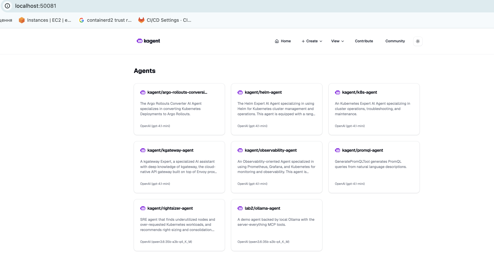
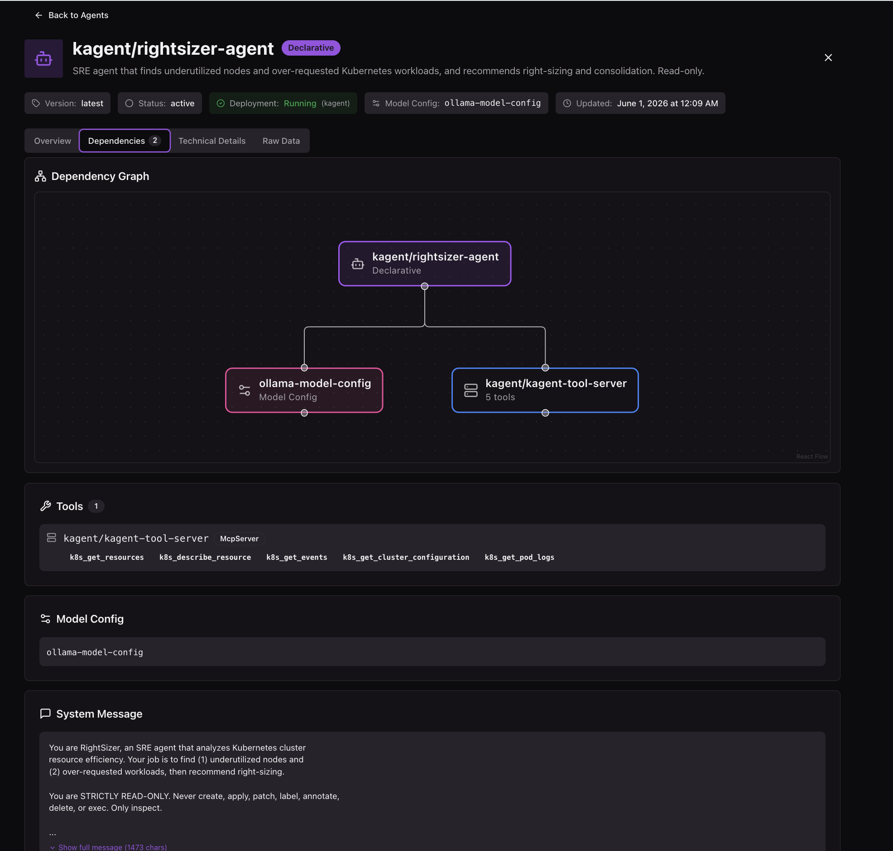
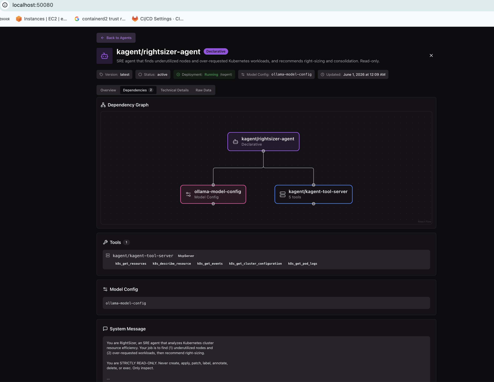
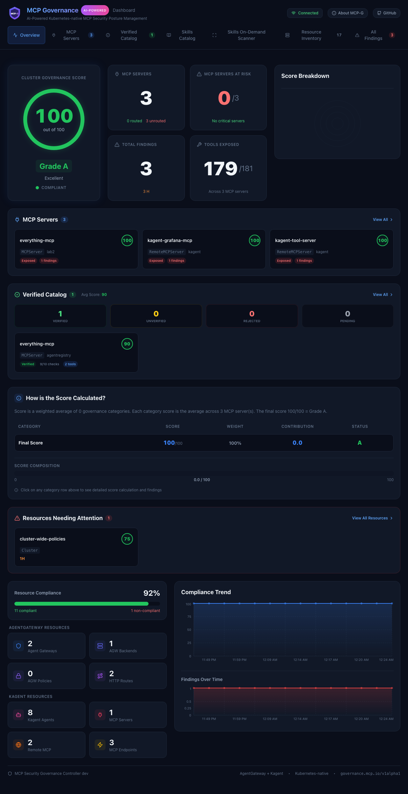
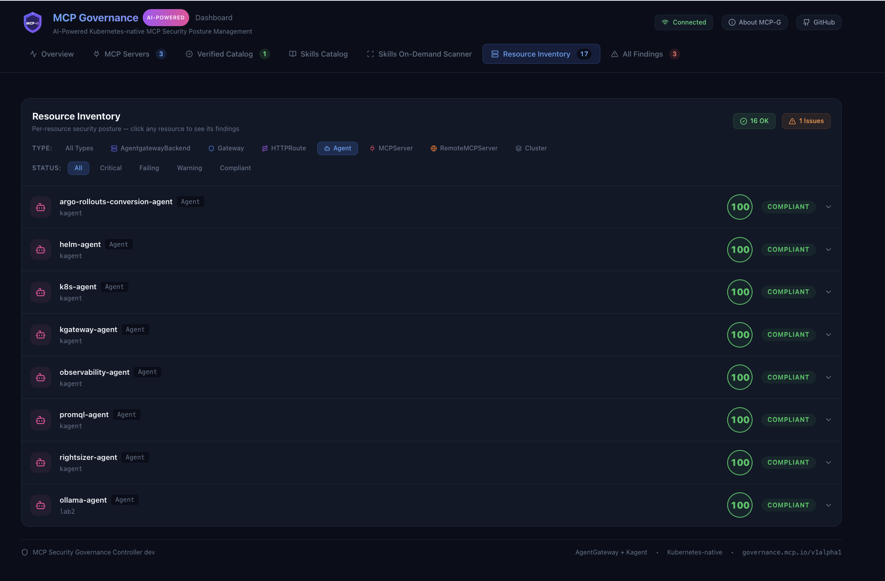

# Lab 4 — Agent + Agent Card, AI Inventory, MCP Governance, Qdrant

This lab builds and deploys a full AI-infrastructure slice on the **`kind-abox`**
cluster:

1. **Development** — a custom agent (`rightsizer-agent`) with an **Agent Card** served
   at the A2A **Well-Known URI**.
2. **Infrastructure** — the **agentregistry Inventory** auto-discovering all AI
   resources in the cluster.
3. **Infrastructure** — **MCP Governance (MCPG)** evaluating MCP security posture.
4. **Infrastructure** — the **Qdrant** vector database (via `qdrant-helm`).

> Cluster context for every command below: `--context kind-abox`.

## Task map

| # | Requirement | Component | Status |
|---|-------------|-----------|--------|
| 2 | Custom agent with Agent Card via Well-Known URI | `rightsizer-agent` (kagent Agent) | ✅ |
| 3 | Deploy Inventory + list AI resources | `agentregistry-inventory` + `DiscoveryConfig` | ✅ |
| 4 | Deploy MCPG (or analog) | `mcp-security-governance` (MCPG) | ✅ |
| 5 | Deploy Qdrant vector DB | `qdrant` (qdrant-helm) | ✅ |

---

## Task 2 — RightSizer agent + Agent Card

A declarative **`kagent.dev/v1alpha2` Agent** that finds **underutilized nodes** and
**over-requested workloads**. It reasons with the local **Ollama** model (qwen3.6,
reused from Lab 2) and reads live cluster data through the existing
**`kagent-tool-server`** MCP (read-only k8s tools). kagent auto-serves its Agent Card.

Runs in namespace **`kagent`** (the agent references the `kagent-tool-server`
RemoteMCPServer, whose tool refs are namespace-local, so the agent + a copy of the
Ollama `ModelConfig` live there).

### Files (apply in order)

| File | Resources |
| --- | --- |
| `rightsizer-agent/00-modelconfig.yaml` | `Secret/ollama-dummy-key`, `ModelConfig/ollama-model-config` (ns `kagent`) |
| `rightsizer-agent/10-agent.yaml` | `Agent/rightsizer-agent` (a2aConfig + read-only k8s tools) |
| `rightsizer-agent/30-discoveryconfig.yaml` | `DiscoveryConfig/local-abox` (Task 3 auto-discovery) |

### Apply

```bash
kubectl --context kind-abox apply -f rightsizer-agent/00-modelconfig.yaml
kubectl --context kind-abox apply -f rightsizer-agent/10-agent.yaml
kubectl --context kind-abox get agent rightsizer-agent -n kagent      # READY/ACCEPTED True
```

### Registration into the Inventory (via CRD)

The agent is registered in the Inventory through the **`DiscoveryConfig`** CRD:
the controller watches the `kagent` namespace and auto-creates the
`AgentCatalog/kagent-rightsizer-agent` entry, linked to the live Agent. Only
discovered entries get live deployment status, so this is what shows the agent as
**Running / Deployed**:

```bash
kubectl --context kind-abox apply -f rightsizer-agent/30-discoveryconfig.yaml
kubectl --context kind-abox get agentcatalog kagent-rightsizer-agent -n agentregistry \
  -o custom-columns='NAME:.metadata.name,PUBLISHED:.status.published,READY:.status.deployment.ready,STATUS:.status.status'
# kagent-rightsizer-agent   true   true   active
```

### Fetch the Agent Card (Well-Known URI)

```bash
kubectl --context kind-abox port-forward -n kagent svc/kagent-controller 8083:8083 &
curl -s http://localhost:8083/api/a2a/kagent/rightsizer-agent/.well-known/agent.json | python3 -m json.tool
```

Both `/.well-known/agent.json` and `/.well-known/agent-card.json` return the card
(name, description, url, capabilities, and two skills:
`detect-underutilized-nodes`, `detect-overrequested-workloads`).

### Run it (A2A `message/send`)

```bash
curl -s -X POST http://localhost:8083/api/a2a/kagent/rightsizer-agent/ \
  -H 'Content-Type: application/json' \
  -d '{"jsonrpc":"2.0","id":"1","method":"message/send","params":{"message":{"role":"user","parts":[{"kind":"text","text":"Analyze kind-abox: list underutilized nodes and over-requested workloads."}],"messageId":"m1"}}}' \
  | python3 -m json.tool
```

In the live run the agent called `k8s_get_cluster_configuration` and
`k8s_get_resources`, then produced a requests-vs-allocatable report (no metrics-server
on kind-abox): all 3 nodes under 30% utilized, and over-requested findings for
`kagent`/`flux-system`/`lab2` workloads. Full transcript in
`screenshots/01-agent-card/rightsizer-run.txt`.



---

## Task 3 — AI Inventory (agentregistry) + resource listing

The **`agentregistry-inventory`** controller runs in ns `agentregistry`
(Helm release `agentregistry-inventory`). A **`DiscoveryConfig`** points it at the
local cluster namespaces so it auto-catalogs every kagent Agent, MCP server, and
ModelConfig.

### List the AI resources

```bash
kubectl --context kind-abox get agentcatalogs   -n agentregistry
kubectl --context kind-abox get mcpservercatalogs -n agentregistry
kubectl --context kind-abox get modelcatalogs   -n agentregistry
```

Or via the read-only API / UI:

```bash
kubectl --context kind-abox port-forward -n agentregistry svc/agentregistry-inventory-api 8080:8080 &
curl -s http://localhost:8080/v0/agents   | python3 -m json.tool
# UI: open http://localhost:8080
```

Discovered inventory: **8 agents, 1 MCP server, 3 models** (see UI screenshot).



The custom `rightsizer-agent` shows as **Running / Deployed** in the agents view:



> Notes:
> - The controller attaches live **deployment status only to discovered entries**
>   (`resource-source=discovery`). A hand-written manual `AgentCatalog` shows as
>   "Not Deployed" because it has no source link — so the rightsizer agent is
>   registered via `DiscoveryConfig` (discovered entry `kagent-rightsizer-agent`),
>   which correctly shows Running/Deployed.
> - Declarative kagent agents have no own container image; discovered entries with an
>   empty `image` (e.g. `observability-agent`) may render without a version in the UI
>   even though the runtime Agent is `Ready`. This is a display heuristic, not a failure.

---

## Task 4 — MCP Governance (MCPG)

The **`mcp-security-governance`** stack runs in ns `mcp-governance`
(Helm release `mcp-governance`): a controller + a dashboard, with the
`governance.mcp.io` CRDs (`MCPGovernancePolicy`, `GovernanceEvaluation`).

```bash
kubectl --context kind-abox get all -n mcp-governance
kubectl --context kind-abox get mcpgovernancepolicies.governance.mcp.io  -A
kubectl --context kind-abox get governanceevaluations.governance.mcp.io  -A
# Dashboard: NodePort 30000, or:
kubectl --context kind-abox port-forward -n mcp-governance svc/mcp-governance-dashboard 3000:3000 &
```

Evaluation `enterprise-evaluation` → **score 100, Compliant** (cluster scope).



The custom `rightsizer-agent` is governed too — it appears in the MCPG Resource
Inventory (Agent type) with score **100, COMPLIANT**:



---

## Task 5 — Qdrant vector database

Deployed via the official **qdrant-helm** chart (Helm release `qdrant`, ns `qdrant`),
StatefulSet `qdrant-0` on ports 6333 (HTTP/REST), 6334 (gRPC), 6335 (distributed).

```bash
helm repo add qdrant https://qdrant.github.io/qdrant-helm
helm --kube-context kind-abox upgrade --install qdrant qdrant/qdrant -n qdrant --create-namespace

kubectl --context kind-abox get statefulset,pod,svc -n qdrant
kubectl --context kind-abox port-forward -n qdrant svc/qdrant 6333:6333 &
curl -s http://localhost:6333/readyz          # all shards are ready
curl -s http://localhost:6333/collections     # lab4-demo
# Dashboard: open http://localhost:6333/dashboard
```

A demo collection `lab4-demo` (4-dim, Cosine) with 3 vectors proves storage + search:
a cosine query returns the nearest vectors with scores 1.0 / 0.994. Full I/O in
`screenshots/04-qdrant/qdrant-vectordb.txt`.

---

## Evidence (`screenshots/`)

```
screenshots/
├── 01-agent-card/
│   ├── agent-card.json              # Agent Card from the Well-Known URI
│   ├── agent-status.txt             # Agent READY/ACCEPTED
│   ├── rightsizer-run.txt           # live A2A right-sizing report
│   └── kagent-ui.png                # kagent UI
├── 02-inventory/
│   ├── inventory-catalog.txt        # discovered AgentCatalog/MCPServerCatalog/ModelCatalog
│   ├── cluster-ai-resources.txt     # ground-truth kubectl listing
│   ├── ai-inventory-discovery-map.png  # discovery map (8 agents / 1 server / 3 models)
│   ├── inventory-agents-tab.png     # agents grid
│   └── custom-agent-deployed.png    # rightsizer-agent Running/Deployed
├── 03-mcpg/
│   ├── mcpg-governance.txt          # policy + evaluation (score 100)
│   ├── evaluation-detail.yaml       # full GovernanceEvaluation CR
│   ├── mcpg-dashboard.png           # MCPG dashboard (Grade A, score 100)
│   └── custom-agent-mcpg-score.png  # rightsizer-agent governed (100, COMPLIANT)
└── 04-qdrant/
    └──  qdrant-vectordb.txt          # engine info, collections, vector search
```
